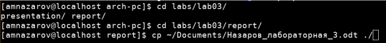

---
## Front matter
title: "Отчет по лабораторной работе № 3"
subtitle: "Архитектура компьютера"
author: "Назаров Алексей Михайлович"

## Generic otions
lang: ru-RU
toc-title: "Содержание"

## Bibliography
bibliography: bib/cite.bib
csl: pandoc/csl/gost-r-7-0-5-2008-numeric.csl

## Pdf output format
toc: true # Table of contents
toc-depth: 2
lof: true # List of figures
fontsize: 12pt
linestretch: 1.5
papersize: a4
documentclass: scrreprt
## I18n polyglossia
polyglossia-lang:
  name: russian
  options:
	- spelling=modern
	- babelshorthands=true
polyglossia-otherlangs:
  name: english
## I18n babel
babel-lang: russian
babel-otherlangs: english
## Fonts
mainfont: PT Serif
romanfont: PT Serif
sansfont: PT Sans
monofont: PT Mono
mainfontoptions: Ligatures=TeX
romanfontoptions: Ligatures=TeX
sansfontoptions: Ligatures=TeX,Scale=MatchLowercase
monofontoptions: Scale=MatchLowercase,Scale=0.9
## Biblatex
biblatex: true
biblio-style: "gost-numeric"
biblatexoptions:
  - parentracker=true
  - backend=biber
  - hyperref=auto
  - language=auto
  - autolang=other*
  - citestyle=gost-numeric
## Pandoc-crossref LaTeX customization
figureTitle: "Рис."
tableTitle: "Таблица"
listingTitle: "Листинг"
lofTitle: "Список иллюстраций"
lolTitle: "Листинги"
## Misc options
indent: true
header-includes:
  - \usepackage{indentfirst}
  - \usepackage{float} # keep figures where there are in the text
  - \floatplacement{figure}{H} # keep figures where there are in the text
---

# Цели и задачи

1. Ознакомиться с системой контроля версий GIT.
2. Изучить идеологию применения средств контроля версий.

# Выполнение лабораторной работы

## Изменим настройки GIT с помощью git config

(рис. [-@fig:001])

{ #fig:001 width=70% }

## Создание SSH ключей

Сгенерируем ключи (рис. [-@fig:002])

{ #fig:002 width=70% }

Созданные ключи находятся в директории ~/.ssh c.

## Скопируем публичный ключ коммандой:

(рис. [-@fig:003])

{ #fig:003 width=70% }

## Добавим публичный ключ на GitHub

Создадим аккаунт на GitHub и добавим Ssh ключ. (рис. [-@fig:004])

{ #fig:004 width=70% }

Откроем вкладку SSH and GPG keys, перейдя в настройки. (рис. [-@fig:005])

{ #fig:005 width=70% }

## Добавим публичный ключ

(рис. [-@fig:006])

{ #fig:006 width=70% }

## Откроем терминал и создадим рабочее пространство и каталог для предмета «Архитектура компьютера»

(рис. [-@fig:007])

{ #fig:007 width=70% }

## Создадим новый репозиторий из шаблона

(рис. [-@fig:008])

{ #fig:008 width=70% }

## Перейдем в каталог курса и склонируем репозиторий

(рис. [-@fig:009])

{ #fig:009 width=70% }

Теперь каталог курса находится в arch-pc.

## Настроим содержимое курса

Удалим файл package.json. (рис. [-@fig:010])

{ #fig:010 width=70% }

Создадим необходимые каталоги. (рис. [-@fig:011])

{ #fig:011 width=70% }

Исполнив комманду ls, мы проверили что package.json удалился, а
COURSE создался. Также, после выполнения команды make, создался
каталог labs.

## Отправим файлы на сервер

(рис. [-@fig:012]), (рис. [-@fig:013]), (рис. [-@fig:014])

{ #fig:012 width=70% }

{ #fig:013 width=70% }

{ #fig:014 width=70% }

## Перейдем на страницу репозитория на GitHub и проверим правильность

(рис. [-@fig:015])

{ #fig:015 width=70% }

Видим, что последние изменения 6 минут назад и появился каталог labs.

# Задания для самостоятельной работы

## Создадим отчет по выполнению лабораторной работы в соответствующем каталоге рабочего пространства

(рис. [-@fig:016])

{ #fig:016 width=70% }

Я создаю отчет во время выполнения лабораторной работы, поэтому нужно
просто его переместить в папку с отчетами.

## Скопируем отчеты о предыдущих работах в соответствующий каталог рабочего пространства.

(рис. [-@fig:017])

{ #fig:017 width=70% }

Теперь предыдущие отчеты лежат в папке report каталогов lab02 и lab03.
Так как я находился в каталоге lab03, я указазывал относительные пути
../../lab02/report и ../../lab01/report, что бы не писать полные пути.

## Загрузим файлы на GitHub

Для этого вернемся из lab03 в arch-pc и выполним комманду git add. (рис. [-@fig:018])

{ #fig:018 width=70% }

Я использовал опцию —all, что бы добавить все изменения.

Выполним комманду git commit что бы сохранить изменения. (рис. [-@fig:019])

{ #fig:019 width=70% }

Загрузим изменения на GitHub. рис. [-@fig:020])

{ #fig:020 width=70% }

## Выводы

При проведении лабораторной работы, мы ознакомились с системой
контроля версий GIT, изучили идеологию применения VCS, создали
репозиторий из шаблона, внесли в него некоторые изменения и добавили
свои отчеты.

