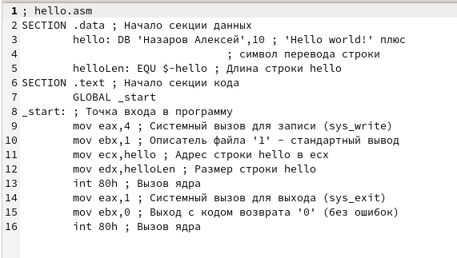

---
## Front matter

title: "Лабораторная работа №5 \\ Создание и процесс обработки программ на языке ассемблера NASM"
subtitle: "Дисциплина: Архитектура ЭВМ"
author: "Алексей Назаров"

## Generic otions
lang: ru-RU
toc-title: "Содержание"

## Bibliography
bibliography: bib/cite.bib
csl: pandoc/csl/gost-r-7-0-5-2008-numeric.csl

## Pdf output format
toc: true # Table of contents
toc-depth: 2
lof: true # List of figures
lot: true # List of tables
fontsize: 12pt
linestretch: 1.5
papersize: a4
documentclass: scrreprt
## I18n polyglossia
polyglossia-lang:
  name: russian
  options:
	- spelling=modern
	- babelshorthands=true
polyglossia-otherlangs:
  name: english
## I18n babel
babel-lang: russian
babel-otherlangs: english
## Fonts
mainfont: PT Serif
romanfont: PT Serif
sansfont: PT Sans
monofont: PT Mono
mainfontoptions: Ligatures=TeX
romanfontoptions: Ligatures=TeX
sansfontoptions: Ligatures=TeX,Scale=MatchLowercase
monofontoptions: Scale=MatchLowercase,Scale=0.9
## Biblatex
biblatex: true
biblio-style: "gost-numeric"
biblatexoptions:
  - parentracker=true
  - backend=biber
  - hyperref=auto
  - language=auto
  - autolang=other*
  - citestyle=gost-numeric
## Pandoc-crossref LaTeX customization
figureTitle: "Рис."
tableTitle: "Таблица"
listingTitle: "Листинг"
lofTitle: "Список иллюстраций"
lotTitle: "Список таблиц"
lolTitle: "Листинги"
## Misc options
indent: true
header-includes:
  - \usepackage{indentfirst}
  - \usepackage{float} # keep figures where there are in the text
  - \floatplacement{figure}{H} # keep figures where there are in the text
---

# Цель работы

Освоение процедуры компиляции и сборки программ, написанных на ассемблере NASM

# Выполнение лабораторной работы
## Программа Hello world!

### Создадие файла
Создадим каталог lab05  

{ #fig:001 width=70% }

Перейдем в него

{ #fig:002 width=70% }

Создадим текстовый файл с именем hello.asm

{ #fig:003 width=70% }

### Написание программы

Откроем файл через gedit

{ #fig:004 width=70% }

Введем в файл текст и сохраним

### Использование Транслятора

Скомпилируем hello.asm. Введем команду в терминале.
Проверим с помощью комманды ls, что создался hello.o

{ #fig:005 width=70% }

#### Использование расширенного синтаксиса NASM

Выполним следующую комманду, чтобы создать объектный файл с именем obj.o и создать листинг

{ #fig:006 width=70% }

Проверим с помощью комманды ls, что создались obj.o и list.lst

### Использование компоновщика LD

Передадим файл на компоновку с помощью комманды в консоли

{ #fig:007 width=70% }

С помощью комманды ls, убедимся, что файл hello создался

#### Воспользуемся дополнительным расширениями компоновщика

выполним комманду, с опцией -o main

{ #fig:008 width=70% }

Как видим, создался файл с main 

### Запустим исполняемый файл

Исполним комманду

{ #fig:009 width=70% }

На экран вывелось  Hello World

## Задания для самостоятельной работы

Скопируем файл hello.asm в lab5.asm и откроем его в текстовом редакторе

{ #fig:010 width=70% }

Заменим "Hello World" на "Назаров Алексей"

{ #fig:011 width=70% }

Оттранслируем lab5.asm в объектный файл

{ #fig:012 width=70% }

Выполним компановку объектного файлыа

{ #fig:013 width=70% }

Перекопируем папку в локальный репозиторий

{ #fig:014 width=70% }

Закоммитим изменения 

{ #fig:015 width=70% }

Загрузим файлы на GitHub коммандой git push

# Выводы

Я освоенил процедуры компиляции и сборки программ, написанных на ассемблере NASM, а также улучил свои навыки в работе с текстовым редактором Gedit

# Список литературы{.unnumbered}

