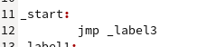

---
## Front matter
title: "Лабораторная работа №8. Команды безусловного и условного переходов в Nasm. Программирование ветвлений."
subtitle: "Дисциплина: Архитектура компьютера"
author: "Алексей Назаров НММбд-02-22"

## Generic otions
lang: ru-RU
toc-title: "Содержание"

## Bibliography
bibliography: bib/cite.bib
csl: pandoc/csl/gost-r-7-0-5-2008-numeric.csl

## Pdf output format
toc: true # Table of contents
toc-depth: 2
lof: true # List of figures
lot: true # List of tables
fontsize: 12pt
linestretch: 1.5
papersize: a4
documentclass: scrreprt
## I18n polyglossia
polyglossia-lang:
  name: russian
  options:
	- spelling=modern
	- babelshorthands=true
polyglossia-otherlangs:
  name: english
## I18n babel
babel-lang: russian
babel-otherlangs: english
## Fonts
mainfont: PT Serif
romanfont: PT Serif
sansfont: PT Sans
monofont: PT Mono
mainfontoptions: Ligatures=TeX
romanfontoptions: Ligatures=TeX
sansfontoptions: Ligatures=TeX,Scale=MatchLowercase
monofontoptions: Scale=MatchLowercase,Scale=0.9
## Biblatex
biblatex: true
biblio-style: "gost-numeric"
biblatexoptions:
  - parentracker=true
  - backend=biber
  - hyperref=auto
  - language=auto
  - autolang=other*
  - citestyle=gost-numeric
## Pandoc-crossref LaTeX customization
figureTitle: "Рис."
tableTitle: "Таблица"
listingTitle: "Листинг"
lofTitle: "Список иллюстраций"
lotTitle: "Список таблиц"
lolTitle: "Листинги"
## Misc options
indent: true
header-includes:
  - \usepackage{indentfirst}
  - \usepackage{float} # keep figures where there are in the text
  - \floatplacement{figure}{H} # keep figures where there are in the text
---

# Цель работы

Изучение команд условного и безусловного переходов. Приобретение навы-
ков написания программ с использованием переходов. Знакомство с назначением и стуруктурой файлов листинга

# Выполнение лабораторной работы

## Создадим каталог для лабораторной и файл lab8-1.asm

{ #fig:001 width=70% }

## Введем в файл lab8-1.asm текст из листинга

{ #fig:002 width=70% }

Запустим программу и посмотрим результат

{ #fig:003 width=70% }

## Изменим код, как показанно в листинге 8.2 

{ #fig:004 width=70% }

Запустим програмуу и посмотрим на измененный резульат

{ #fig:005 width=70% }

## Изменим код, что бы программа выводила 3, 2, 1

Нам достаточно перепрыгивать на label3 в начале, и в конце вывода "3" прыгать на label2, а дальше программа выполнгяется так как и раньше

{ #fig:006 width=70% }

Запустим программу и посмотрим на результат

{ #fig:007 width=70% }

## Создадим lab8-2 и откроем в Gedit

{ #fig:009 width=70% }

Введем код в lab8-2

{ #fig:010 width=70% }

Скомпилируем и исполним программу несколько раз

{ #fig:011 width=70% }

## Изучим листинг

Сгенерируем листинг 

{ #fig:012 width=70% }

{ #fig:013 width=70% }

### Описание трех строчек листинга

- На строке 25 видим номер строки (25), аддрес инструкции в памяти (00000010) и код комманды (51)
- Сравним строкит 5 и 16
- Аддрес инструкции на строке 5 - 00000000
- Аддрес инструкции на строке 16 000000D
- Код инструкции на строке 5 - 53
- Код инструкции на строке 16 5B
- Из этого можем сделать вывод, что код для ebx - 3, потому что 50 + 3 = 53, а 58+3 = 5B, так как код push 50, а pop 58

## Изменим строчку в коде и создадим новый листинг

вместо `cmp ecx, [C]` оставим `cmp ecx,`

{ #fig:014 width=70% }

Сгенририуем листинг

{ #fig:015 width=70% }

Откроем созданный файл листинга

{ #fig:016 width=70% }

Видим, что выведенная при генерации ошибка находится в файле листинга, после измененной строчки

# Задания для самостоятельной работы

Напишем код, который будет выводить наименьшее число из 84, 32, 77 (Так как мой номер 13)

{ #fig:017 width=70% }

Запустим программу и убедимся в правильности результата

{ #fig:0175 width=70% }

Напишем программу, которая будет вычислять функцию 

{ #fig:0185 width=70% }

{ #fig:018 width=70% }

Запустим ее и проверим на данных значениях

{ #fig:019 width=70% }

# Выводы

Мы изучили комманды условного и безусловного переходов в языке асембела NASM, научились писать программы с использованием переходов и иознакомились с назначением и структурой файлов листинга 

# Список литературы{.unnumbered}

::: {#refs}
:::
