---
## Front matter
title: "Лабораторная работа №9. Программирование цикла. Обработка аргументов коммандной строки"
subtitle: "Дисциплина: Архитектура ЭВМ"
author: "Алексей Назаров НММбд-02-22"

## Generic otions
lang: ru-RU
toc-title: "Содержание"

## Bibliography
bibliography: bib/cite.bib
csl: pandoc/csl/gost-r-7-0-5-2008-numeric.csl

## Pdf output format
toc: true # Table of contents
toc-depth: 2
lof: true # List of figures
lot: true # List of tables
fontsize: 12pt
linestretch: 1.5
papersize: a4
documentclass: scrreprt
## I18n polyglossia
polyglossia-lang:
  name: russian
  options:
	- spelling=modern
	- babelshorthands=true
polyglossia-otherlangs:
  name: english
## I18n babel
babel-lang: russian
babel-otherlangs: english
## Fonts
mainfont: PT Serif
romanfont: PT Serif
sansfont: PT Sans
monofont: PT Mono
mainfontoptions: Ligatures=TeX
romanfontoptions: Ligatures=TeX
sansfontoptions: Ligatures=TeX,Scale=MatchLowercase
monofontoptions: Scale=MatchLowercase,Scale=0.9
## Biblatex
biblatex: true
biblio-style: "gost-numeric"
biblatexoptions:
  - parentracker=true
  - backend=biber
  - hyperref=auto
  - language=auto
  - autolang=other*
  - citestyle=gost-numeric
## Pandoc-crossref LaTeX customization
figureTitle: "Рис."
tableTitle: "Таблица"
listingTitle: "Листинг"
lofTitle: "Список иллюстраций"
lotTitle: "Список таблиц"
lolTitle: "Листинги"
## Misc options
indent: true
header-includes:
  - \usepackage{indentfirst}
  - \usepackage{float} # keep figures where there are in the text
  - \floatplacement{figure}{H} # keep figures where there are in the text
---

# Цель работы

Приобретение навыков написания программ с использованием циклов и
обработкой аргументов командной строки.

# Выполнение лабораторной работы

Создадим каталог для программ лабораторной №9, создадим в нем файл. 

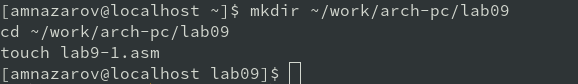{ #fig:001 width=70% }

Введем код из листинга 9.1

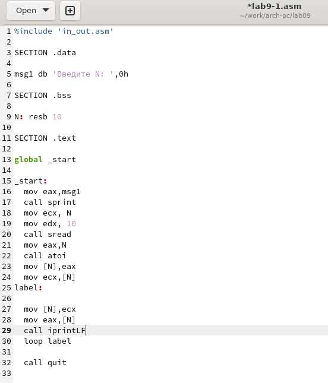{ #fig:002 width=70% }

Запустим код и введем 5

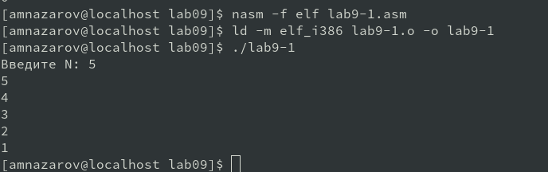{ #fig:003 width=70% }

## Изменим текст программы следующим образом:

Добавим строчку с уменьшением ecx

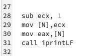{ #fig:004 width=70% }

Исполним программу. 

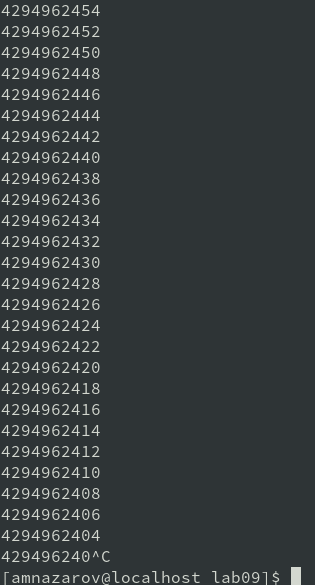{ #fig:005 width=70% }

Как видим, программа начала выводить очень большие числа, потому что произошло переполнение буффера. Когда мы от 0 отняли 1.

## Изменим код и добавим    push и pop. 

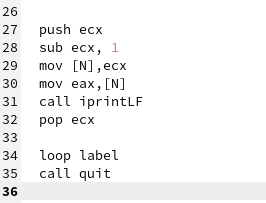{ #fig:006 width=70% }

Исполним и посмотрим на результат.

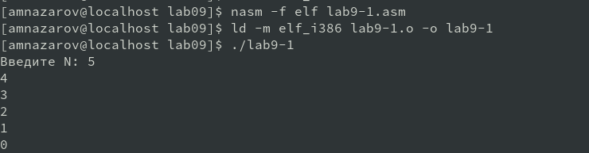{ #fig:007 width=70% }

Видим, что выводится 4 3 2 1, так как мы уменьшили значение ecx на 1, но переполнения буффера не случилось.

## Вывод на экран аргументов коммандной строки

Введем  в файл `lab9-2.asm` листинг 9.2

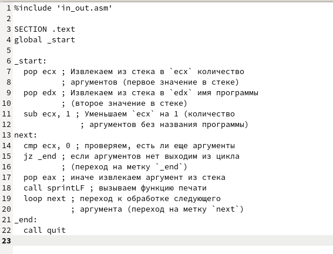{ #fig:009 width=70% }

Странслируем, слинкуем и запустим программу.

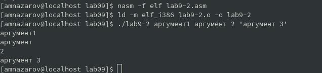{ #fig:010 width=70% }

Для четырех аргументов вывелось 4 строки.

## Вычисление суммы аргументов коммандной строки.

Напишем текст из листинга `9.3` в файл lab9-3.asm.

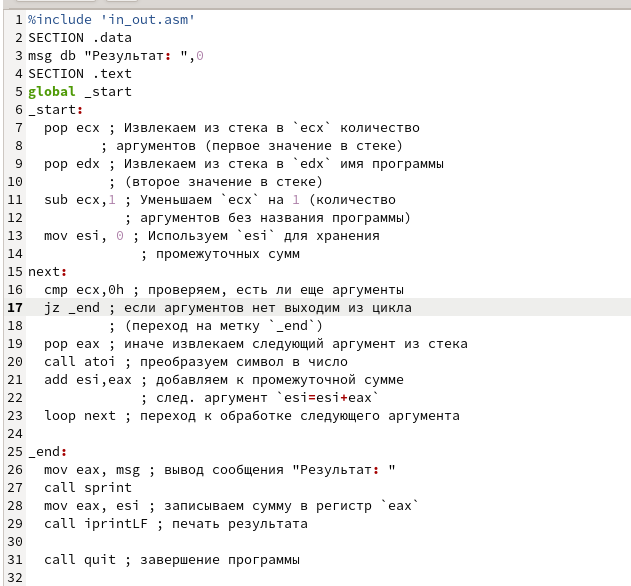{ #fig:011 width=70% }

Скомпилируем и запустим `lab9-3` с аргументами  (12 13 7 10 5)

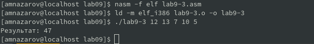{ #fig:012 width=70% }

Программа вывела сумму аргументов

## Вычисление произведение аргументов коммандной строки

Скопируем файл lab9-3.asm в lab9-3.1.asm и изменим следующие строчки:

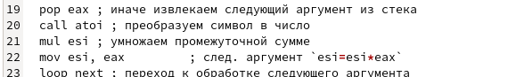{ #fig:013 width=70% }

Запустим программу lab9-3.1 с аргументами 1 2 3 4 и 1 2 3 4 5

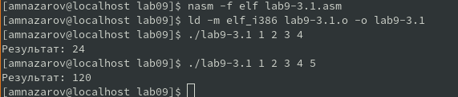{ #fig:014 width=70% }

# Задание для самостоятельной работы.

Мой вариант 13, поэтому  напишем программу которая будет вычеслять сумму функций f(x) = 12x - 7 от значений аргументов, введенных в коммандной строке.

Напишем программу в файл lab9-4.asm по вычислению этой функции

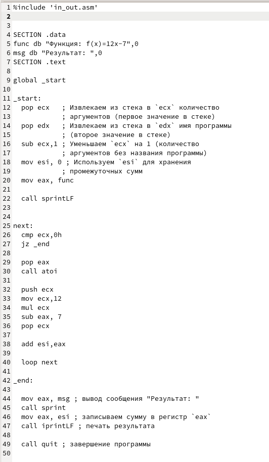{ #fig:015 width=70% }

Скомпилируем и запустим программу с аргументами 1 2 3 4.

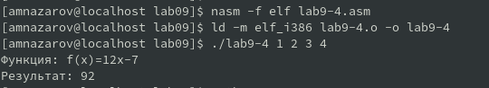{ #fig:016 width=70% }

# Выводы

Мы приобрели навыки написание программ с использованием циклов и обработткой аргументов коммандной строки. 
